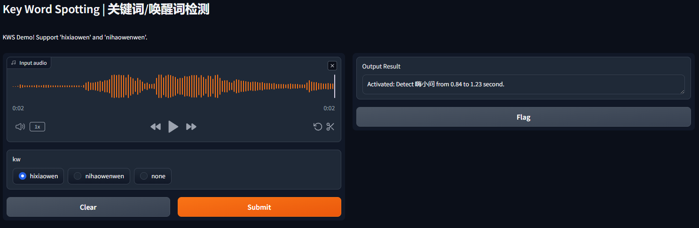
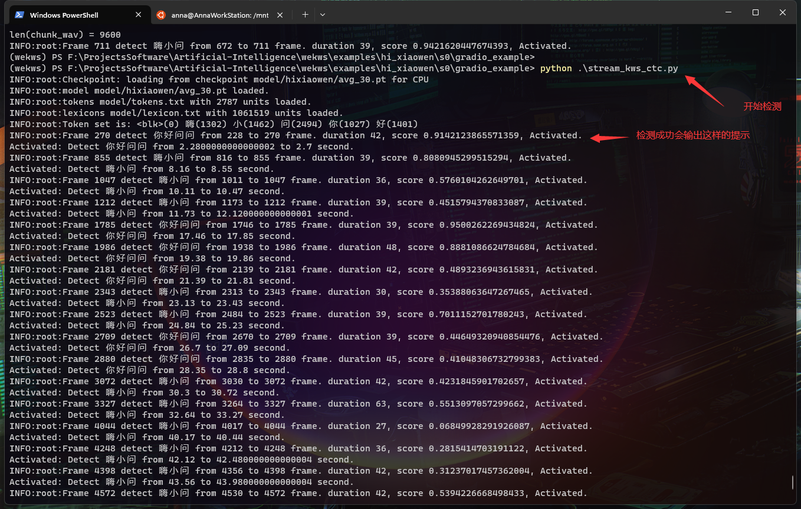

KWS (keyword spotting) research
===========================================================

# about this repo
## 1. what is wekws
1. This repo is forked from https://github.com/wenet-e2e/wekws, [this is the original doc](./README-wekws.md)
2. As a forked repo, why create a new repo rather than a "fork"? <br>
  Because the github dose not support the lfs upload into a forked repo, and I need lfs on my developments. In addition, I made some incompatible modifications and have no plan to make a pull request to the original wekws.
## 2. download dataset
* 方案1,使用脚本下载AISHELL2, musan, dns_challenge数据集
  `python tools/download.py <download_dir>`, 该方案从aliyun镜像下载,并且会进行解压缩,并生成文件列表all.txt
* 方案2,手动下载
  1. [Hi-MIA(你好米雅): A far-field text-dependent speaker verification database for AISHELL Speaker Verification Challenge 2019](https://www.openslr.org/85/)
  2. [LibriSpeech: Large-scale (1000 hours) corpus of read English speech](https://www.openslr.org/12/)
  3. [THCHS30: A Free Chinese Speech Corpus Released by CSLT@Tsinghua University](https://www.openslr.org/18/)
  4. [AIShell-1: An Open-Source Mandarin Speech Corpus and A Speech Recognition Baseline](http://www.openslr.org/33/)
  5. [MUSAN: a corpus of music, speech, and noise recordings.](https://www.openslr.org/17/)
  6. [AISHELL-2: the largest free speech corpus available for Mandarin ASR research](https://github.com/kaldi-asr/kaldi/tree/master/egs/aishell2)
  7. [dns_challenge: ICASSP 2023 Deep Noise Suppression Challenge](https://github.com/microsoft/DNS-Challenge)
  8. ["hi小问、你好问问": Chinese hotwords detection dataset, provided by Mobvoi CO.,LTD](https://www.openslr.org/87/)
* 数据说明
  1. 这些数据集中只有`Hi-MIA`和`hi小问`数据集适合作为正样本进行语音唤醒(KWS)模型的训练与研究,其他数据集均只适合与作为无关样本或负样本.
  2. `HI-MIA`的音频的主要差异是距离话筒远近不同,`hi小问`的数据更加多样化,包含了合成语音和加噪数据,以及各种语调.
  3. `AISHELL-2`数据集需要进行申请,提供方没有提供下载链接,申请成功后会收到邮件,需要邮寄硬盘获取数据.
## 3.training
### 1. create training dataset
  1. 训练使用himia数据集作为唤醒词（正例）数据来源，AISHELL2数据集作为非唤醒词（反例）数据来源. 在开发阶段,对于训练集,随机选出1000段正样本和1000段副样本，对于验证集,分别选出100段, 均转为16k采样, 具体才做方法如下:
  2. 使用`python tools/create_dataset.py`进行训练集合和验证集的采样和转换, 并创建文件列表文件`wav.scp`和标签文件`label.txt`.
  3. 使用`bash tools/wav_to_duration.sh /path/to/wav.scp /path/to/wav.dur`创建dur文件,注意训练集和验证集都需要生成该文件.
  4. 使用`python tools/make_list.py /path/to/wav.scp /path/to/label_text /path/to/wav.dur /path/to/data.list` 生成数据集索引,注意训练集和验证集都需要生成该文件.
  5. 如需增加样本量,修改`tools/create_dataset.py`以实现不同的采样数量.
### 2. one key training pipline（使用的数据集/唤醒词是：‘嗨小问’ 或 ‘你好问问’, 即openslr-87数据集）
  ```bash
  # 安装cuda 12.1，确保/usr/local/cuda/bin已经加入PATH
  # 通过nvcc -V确认版本，通过nvidia-smi确认显卡型号，驱动版本和cuda版本，
  # 确保/usr/local/cuda/lib64路径已经加入LD_LIBRARY_PATH
  sudo apt-get install portaudio19-dev
  cd examples/hi_xiaowen/s0
  conda create -n annakws python=3.9
  conda activate annakws
  pip install -r requirements.txt
  bash run.sh -1 4 # 数据下载-数据处理-训练-模型合并和导出
  # 通过gradio_example进行简单测试。注意gradio_example中自带了一个以LFS形式上传的模型文件和若干音频文件，你可以替换为自己训练的其他模型。
  cd examples/hi_xiaowen/s0/gradio_example
  python app.py
  # stream 测试，即维持音频流的开启，持续进行唤醒检测
  cd examples/hi_xiaowen/s0/gradio_example
  python stream_kws_ctc.py
  ```
  
  

# references and research log
## 1. hot-word detection (voice-trigger, KWS, Keyword Spotting, voice-activated)
    1. [mycroft-precise](https://fancyerii.github.io/books/mycroft-precise/), tf+keras, 重构后复活并兼容新框架,模型精度无法爬坡,但音频处理可以借鉴. [forked by jiafeng5513](https://github.com/jiafeng5513/precise)
    2. [snowboy](https://github.com/Kitt-AI/snowboy), 半开源,效果非常强,但是无法获得模型设计和音频处理细节,多方尝试无法移植到android x86.
    3. [snowman](https://github.com/Thalhammer/snowman), 逆向的[snowboy](https://github.com/Kitt-AI/snowboy), 写的不太好,不建议花时间研究.
    4. [SWIG](https://luoxiangyong.gitbooks.io/swig-documentation-chinese/content/chapter02/02-04-supported_ccpp-language-features.html), 这是用来编译[snowboy](https://github.com/Kitt-AI/snowboy)的,其作用是快速生产C++的其他语音接口.
    5. [Apple ML Research: Voice Trigger System for Siri](https://machinelearning.apple.com/research/voice-trigger)
    6. [paddlespeech 语音唤醒初探](https://www.cnblogs.com/talkaudiodev/p/17176554.html),此乃二手学术资源,谨慎阅读.
    7. [lenovo-voice: PVTC2020](https://github.com/lenovo-voice/THE-2020-PERSONALIZED-VOICE-TRIGGER-CHALLENGE-BASELINE-SYSTEM),一个比赛的基线, 主要作用是引导我找到了数据集.
    8. [paddlespeech 关键词识别](https://github.com/PaddlePaddle/PaddleSpeech/blob/develop/demos/keyword_spotting/README_cn.md)
    9. speechcommand_v1 需要重新编译torchaudio或者切到cuda
    10. hi_sinps需要下载一个需要注册的数据集,已经提交注册[Sonos Voice Experience Open Datasets ](https://docs.google.com/forms/d/e/1FAIpQLSdluk5umSFUJhzcmrcbQJoVNPyMoiQgLoMEXS11Bju0_fF_kw/viewform)
    11. hi_xiaowen 需要重新编译torchaudio或者切到cuda
## advanced papers and repos
   1. [DCCRN-KWS: An Audio Bias Based Model for Noise Robust Small-Footprint Keyword Spotting](https://arxiv.org/pdf/2305.12331.pdf),模型看起来很不错,但是无代码,从论文中看,训练所需的资源可能是不可承受的.
   2. [ML-KWS-for-MCU](https://github.com/ARM-software/ML-KWS-for-MCU)
   3. [paperswithcode: Keyword Spotting](https://paperswithcode.com/task/keyword-spotting/codeless?page=2)
   4. [Learning Efficient Representations for Keyword Spotting with Triplet Loss](https://github.com/roman-vygon/triplet_loss_kws)
   5. [RapidASR](https://github.com/RapidAI/RapidASR),ASR,开源情况不明,[此处](https://github.com/alibaba-damo-academy/FunASR)有代码似乎为语音唤醒.
   6. [Maix-Speech](https://github.com/sipeed/Maix-Speech/blob/master/README_ZH.md),半开源,且主要为ASR和TTS.
   7. [Android离线语音识别](https://xiangnan.github.io/2016/08/19/Android%E7%A6%BB%E7%BA%BF%E8%AF%AD%E9%9F%B3%E8%AF%86%E5%88%AB/),项目过老,其中的release apk无法安装运行于IVI,迁移到新工具链上进行重新编译需要消耗时间进行调试,不建议.
   8. [使用ModelScope训练自有的远场语音唤醒模型](https://developer.aliyun.com/article/1210234)
